# Clinic Overbooking with No-Show Prediction

**Calibrated risk, cost-aware optimisation, and a fairness audit of who bears the overflow**

[](https://www.python.org/)
[](LICENSE)
[](tests/)

Roughly a fifth to a third of scheduled medical appointments are missed. The
clinician sits idle, the slot is gone, and someone further down the wait list
keeps waiting. Clinics respond by overbooking, usually with a flat percentage
applied to every session. This study asks whether patient-level risk estimates
do better than a flat rate, and then asks the question that usually goes
unasked: when overbooking goes wrong, who is standing in the corridor?

The answer to the first question is yes, substantially, under one particular
set of cost assumptions. The answer to the second is more interesting, and
less comfortable, than the headline suggests.

---

## Results at a glance

| | Never overbook | Best predictive policy |
|---|---|---|
| Mean cost per session | $1,289.06 | **$456.99** (95% CI $451.39–$462.96) |
| Utilisation | 57.0% | **85.3%** |
| Overflow probability | 0% | 11.5% |
| Paired bootstrap vs baseline | — | p < 1e-4, 10,000 replicates |

A 64.5% cost reduction, about $832 per session, roughly $598,000 across the
719 held-out sessions.

**Read that number with three qualifications, all of them load-bearing.** It
holds under a cost structure that prices idle clinician time at twice an
overflow patient; invert that ratio and the ranking of policies inverts with
it. The policy that wins is a cost-ratio heuristic rather than the
Poisson-Binomial optimiser the theory section develops. And, most seriously,
the probabilities driving the simulation average 0.429 against a true test-set
no-show rate of 0.261, an over-prediction the pipeline printed and nobody
acted on. Because idle cost scales directly with the no-show rate, that
inflates the baseline this result is measured against, so the true saving is
smaller than 64.5% by an amount only a re-run can establish.

All three are documented in [`docs/limitations.md`](docs/limitations.md),
along with the three separate code paths that can produce the prediction
column without announcing which one ran. The archived notebooks under
[`notebooks/`](notebooks/) carry the outputs these claims are checked against,
so none of it has to be taken on trust.

That section is the part of this repository worth reading first. A result that
survives being described honestly is worth more than one that needs the
caveats kept quiet.

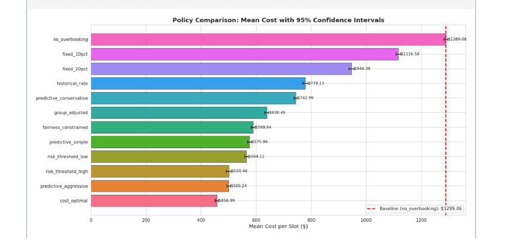

*Twelve policies, 719 sessions, 1,000 Monte Carlo iterations each. The
risk-aware policies (green and orange) separate cleanly from the flat-rate
rules (pink and purple). Error bars are bootstrap confidence intervals on the
mean.*

---

## What the study does

Four stages, each feeding the next.

**Stage 1** cleans 110,527 Brazilian appointment records down to 71,959, builds
sixteen features, and splits them chronologically rather than randomly so that
no patient's future informs their own past.

**Stage 2** trains four models, stacks them, calibrates the probabilities,
explains them with SHAP, and audits them across age and scholarship status.

**Stage 3** turns attendance into a Poisson-Binomial distribution, proves the
expected cost is convex in the overbooking level, and solves for the optimum
under an overflow-probability constraint, extracting the shadow price of that
service-level guarantee.

**Stage 4** simulates twelve policies over the held-out period with confidence
intervals, paired significance tests, cost sensitivity, deliberate model
degradation, and a fairness audit of overflow incidence by group.

---

## Stage 1 — What the data says before any model touches it

Lead time dominates. The no-show rate climbs from 21.4% for same-day
appointments to 34.1% beyond a month. It also climbs at very different rates
for different ages, which is why the feature set carries an explicit age by
lead-time interaction rather than trusting a tree to find it.

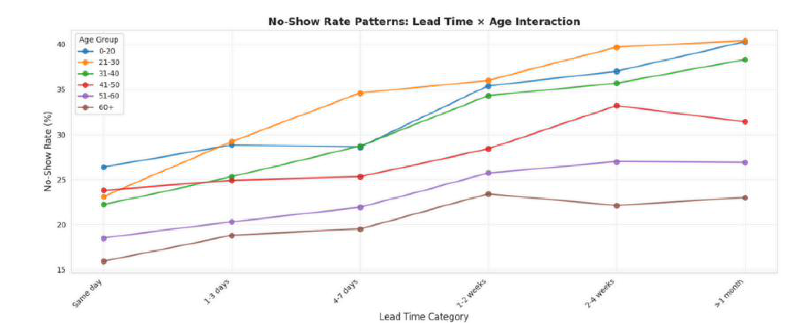

*Patients in their twenties booking a month ahead miss roughly two in five
appointments. Patients over sixty, booking the same distance out, miss about
one in four. The gradient itself is the signal; the gap between the lines is
why the interaction term exists.*

Cleaning removes 38,568 records whose scheduled date falls after the
appointment date, a recording error rather than a same-day booking. Five
features are dropped for carrying no signal: gender, hypertension, diabetes,
alcoholism and handicap status. `Patient_Prior_NoShow_Rate` is built with a
leakage guard so that a patient's own outcome never enters their own feature.

The split is 43,175 / 14,392 / 14,392, in time order. That choice costs
accuracy and is still the right one: random splitting would let later
behaviour leak backwards and would hide drift entirely.

---

## Stage 2 — Risk that can be trusted, not just ranked

Four base learners are trained and stacked with a logistic meta-model.

| Model | Val AUC | Test AUC | Val Brier |
|---|---|---|---|
| **Stacking ensemble** | **0.631** | **0.620** | **0.189** |
| Weighted ensemble | 0.630 | 0.619 | 0.190 |
| XGBoost | 0.630 | 0.618 | 0.189 |
| Random forest | 0.623 | 0.618 | 0.191 |
| Neural network | 0.611 | 0.595 | 0.191 |
| Logistic regression | 0.608 | 0.599 | 0.194 |

**An AUC of 0.62 is weak discrimination and this README is not going to dress
it up.** It sits at the low end of the 0.60 to 0.75 band the no-show
literature reports, and a large share of attendance behaviour is genuinely
unpredictable: illness, traffic, a child's emergency. The validation-to-test
gap is small, so the models generalise; they simply do not separate all that
well.

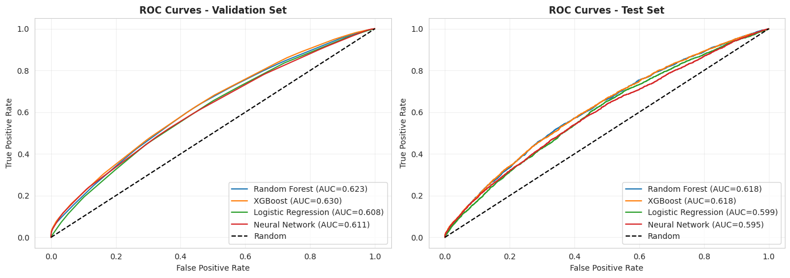

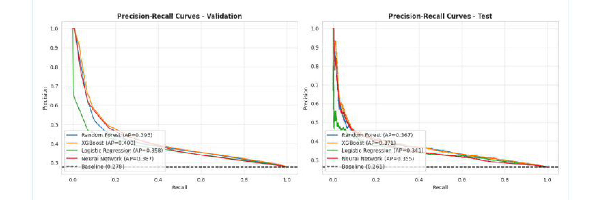

*The companion the ROC panel needs at this base rate. Average precision peaks
at 0.371 on test against a 0.261 baseline, so the lift over chance is real and
slim. That 0.261 is the actual test-set no-show rate, and it is the number the
probabilities reaching stage 3 fail to match.*

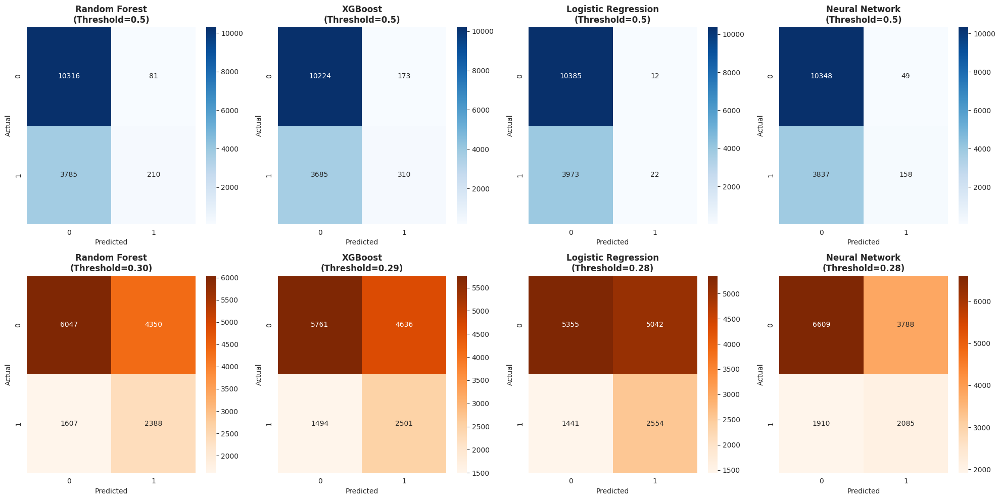

*At the default 0.5 threshold the models barely commit to the positive class:
XGBoost recovers 310 of 3,995 no-shows. Dropping the threshold to about 0.29
lifts that to 2,501, and buys it with a large rise in false positives. Which
of those errors a clinic would rather make is a scheduling question, not a
modelling one.*

The intended argument is that the decision layer does not need
ranking. It needs probabilities that are right on average at every risk level,
because it integrates them directly to compute expected cost. A model that
ranks beautifully but reports inflated probabilities would produce
systematically wrong booking levels while looking excellent on AUC. So
calibration, not discrimination, is the property under test.

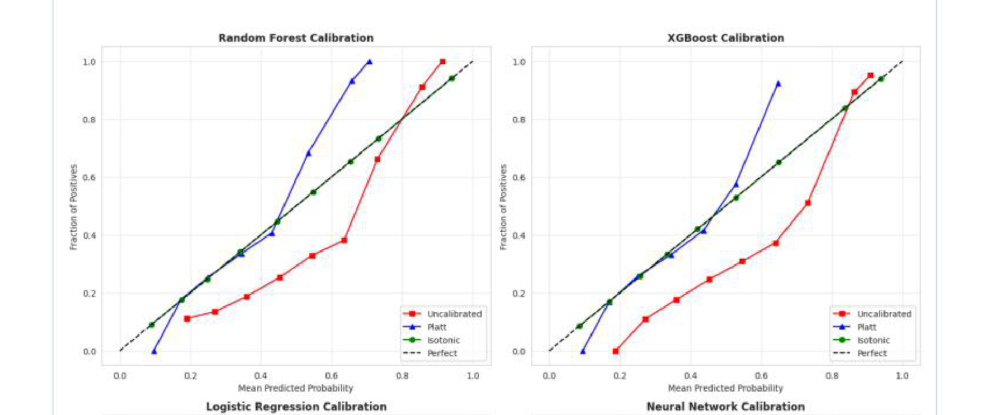
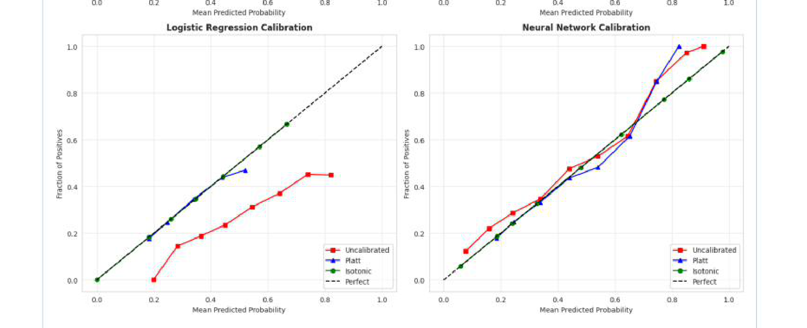

*Uncalibrated predictions in red drift away from the diagonal. Isotonic
regression in green pulls them back onto it.*

Isotonic regression beats Platt scaling on Brier score for all four models, so
it is what the pipeline uses for the individual base learners.

It is not, however, what reaches the optimiser. Stage 3 loads the stacking
ensemble, which bypasses the per-model calibration, and prints the damage as it
goes: mean predicted risk 0.429 against an actual test rate of 0.261. The
argument in the paragraph above is sound and the pipeline does not honour it.
See defect 3 in [`docs/limitations.md`](docs/limitations.md).

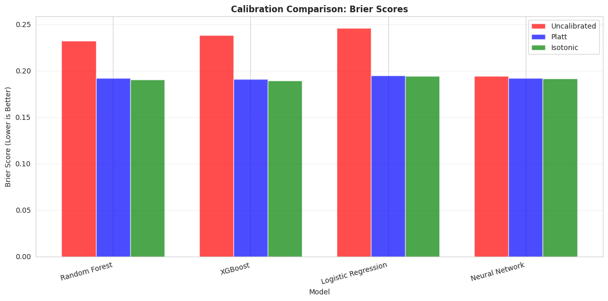

### Explaining the model, and cross-checking the explanation

SHAP attributions on the XGBoost component, with logistic coefficients kept as
a linear cross-check. Agreement between two methods that fail in different
ways is worth more than confidence in either alone.

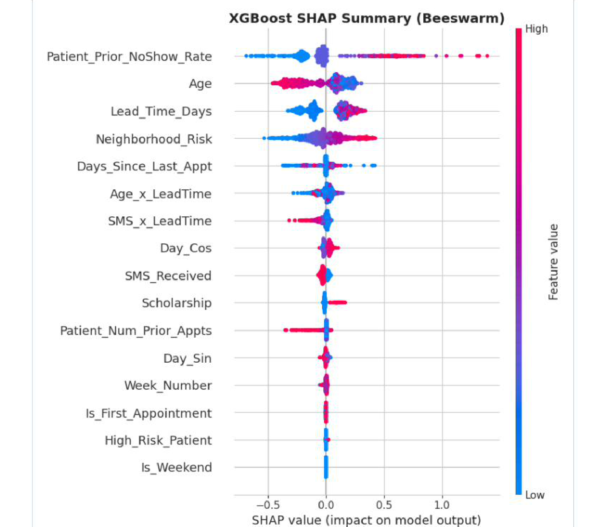

*Each point is one appointment. Position is that feature's contribution to the
predicted risk; colour is the feature's value. Prior no-show history dominates,
and it separates cleanly in both directions: a clean history pulls risk down
about as hard as a poor one pushes it up.*

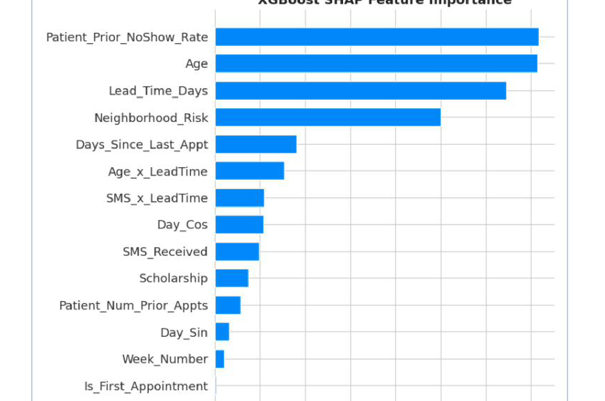
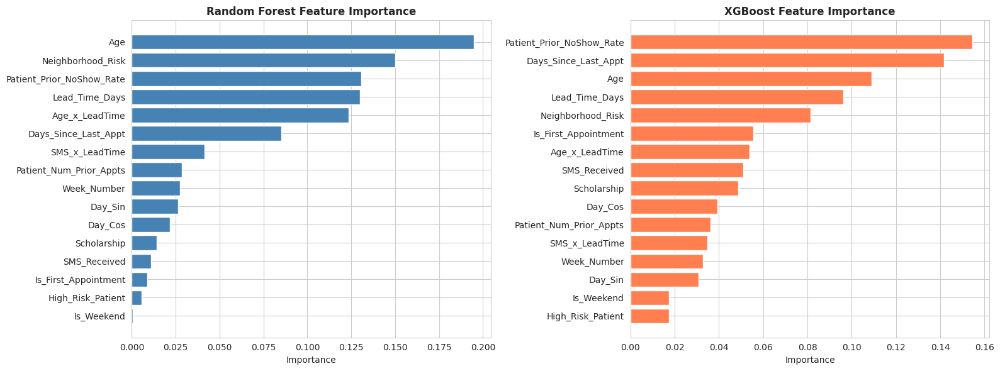

The linear model agrees on direction everywhere it overlaps: age negative
(older patients attend more reliably), lead time positive, scholarship status
positive. That agreement is the point. It is a cheap guard against reading
structure into an attribution method that is partly reporting its own
artefacts.

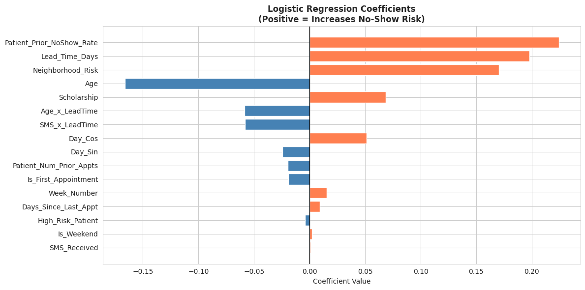

### The audit, before anything is optimised

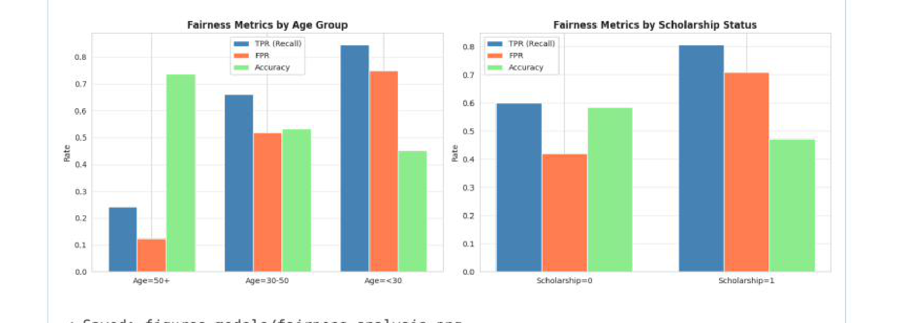

True-positive-rate disparity is **0.60 across age bands** and **0.21 across
scholarship status**. Those are large gaps, and they are not a bug in the
training procedure. Younger patients and scholarship recipients genuinely miss
appointments more often, for reasons that are mostly structural: transport,
inflexible work, fewer symptoms creating urgency. The model reports that
accurately.

Which is exactly what makes the disparity hard to dismiss. The model is not
wrong. It is correct about a difference that exists, and acting on it will
concentrate the consequences on the patients least able to absorb them. That
tension does not resolve at the model layer, so this study carries it forward
to the policy layer, where the burden is actually allocated.

---

## Stage 3 — The optimisation, and what it costs to be careful

Attendance in a session is a sum of independent Bernoulli variables with
*different* probabilities, so arrivals follow a Poisson-Binomial distribution
rather than a Binomial one. The exact PMF comes from an O(n²) dynamic program,
which is trivial at session scale, and expected cost is the PMF-weighted
average of:

```
idle     = max(0, capacity - shows) × service_time × c_idle
overflow = max(0, shows - capacity) × c_overflow
waiting  = overflow × (overflow × service_time / 2) × c_wait
```

The waiting term is quadratic deliberately. The n-th overflow patient waits
behind the n-1 in front of them, so congestion hurts faster than headcount.

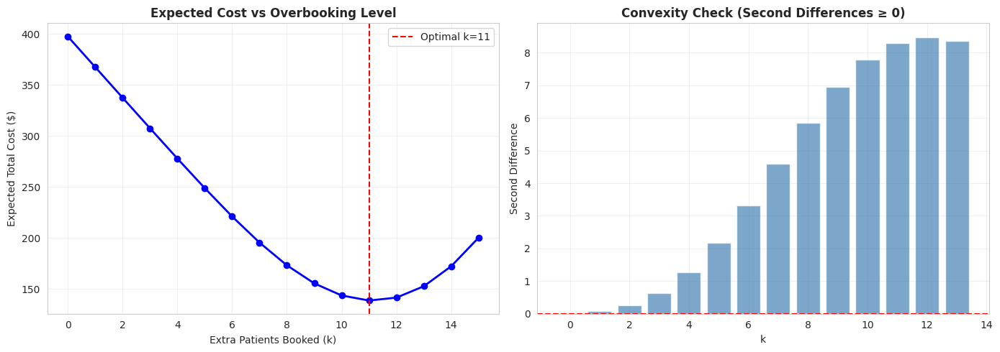

*Left: expected cost against extra bookings, with a single interior minimum.
Right: second differences, all non-negative. Convexity means the enumerated
minimum is global, so a stationary point of the continuous relaxation is the
optimum and not a saddle.*

Then the interesting part. Add a service-level constraint, P(overflow) ≤ α,
and solve under KKT conditions with SLSQP. At α = 0.2 the optimum moves from
k\* = 9.24 to k\* = 5.30, and the Lagrange multiplier on that constraint is a
shadow price: roughly **$760 per unit of overflow-probability guarantee**.

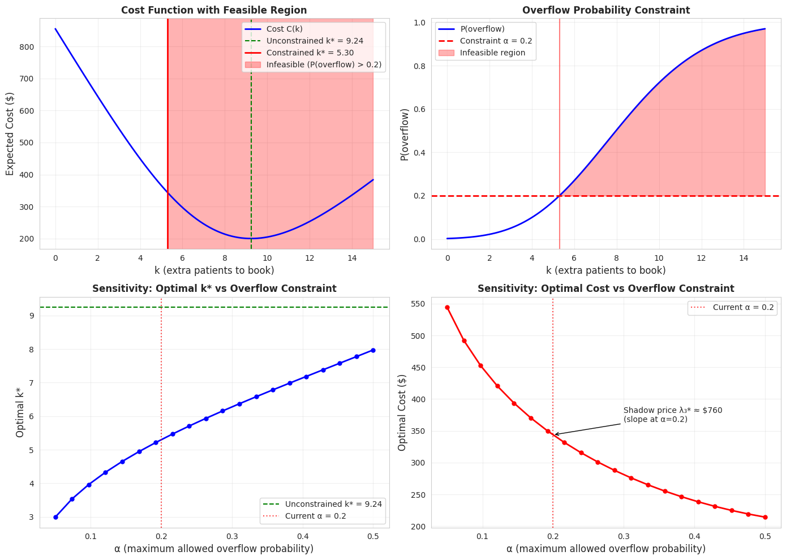

That number is the most useful object in the whole study, because it converts
a preference into something a clinic manager can actually weigh. "Patients
should rarely wait" is a value. "Holding overflow under 20% costs about $760 a
session" is a decision.

---

## Stage 4 — Simulation, stress, and the uncomfortable finding

Twelve policies, 719 held-out sessions of twenty patients, 1,000 Monte Carlo
iterations each, attendance sampled from the calibrated probabilities.

| Policy | Mean cost | Utilisation | Overflow prob. |
|---|---|---|---|
| cost_optimal | $456.99 | 85.3% | 11.5% |
| predictive_aggressive | $500.24 | 83.7% | 8.9% |
| risk_threshold_high | $500.46 | 83.8% | 9.8% |
| risk_threshold_low | $564.11 | 81.5% | 6.1% |
| predictive_simple | $575.96 | 81.0% | 5.3% |
| fairness_constrained | $588.64 | — | 5.0% |
| group_adjusted | $638.49 | — | 3.5% |
| predictive_conservative | $742.99 | — | — |
| historical_rate | $778.15 | — | — |
| fixed_20pct | $946.38 | — | — |
| fixed_10pct | $1,116.58 | — | — |
| no_overbooking | $1,289.06 | 57.0% | 0% |

Every risk-aware policy beats every flat-rate policy. That gap is the
study's actual contribution: patient-level risk is worth something over a
uniform percentage, and the amount is large.

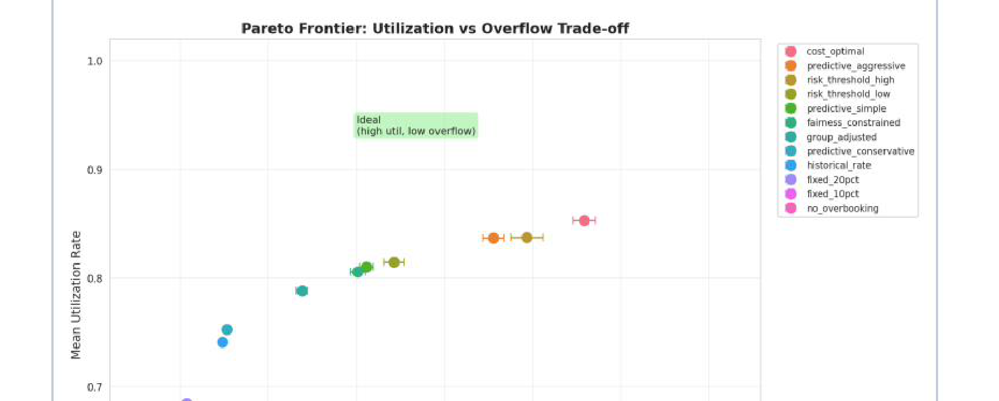

*There is no policy that is simply best. `cost_optimal` buys its utilisation
with a 11.5% overflow rate; `predictive_simple` gives up $119 per session to
keep overflow at 5.3%. Which trade a clinic should take is not a question the
optimiser can answer.*

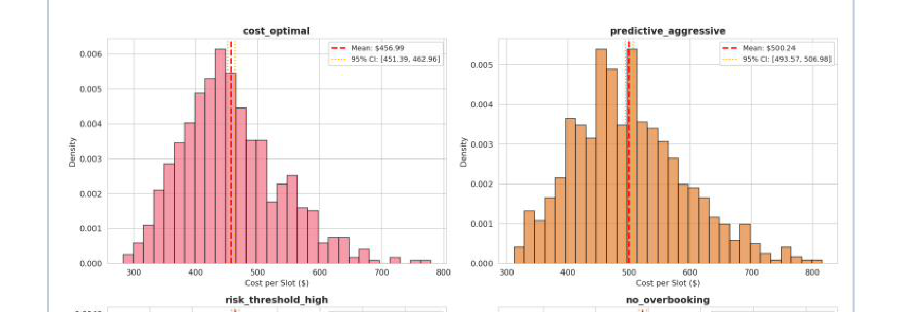
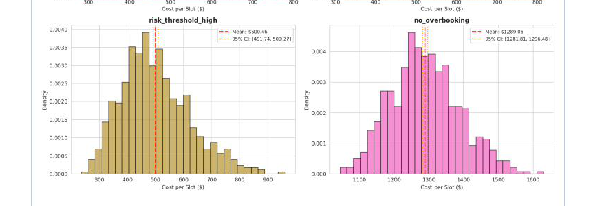

### The ranking is not stable, and that is the finding

Re-run the comparison across five cost structures and the winner changes.

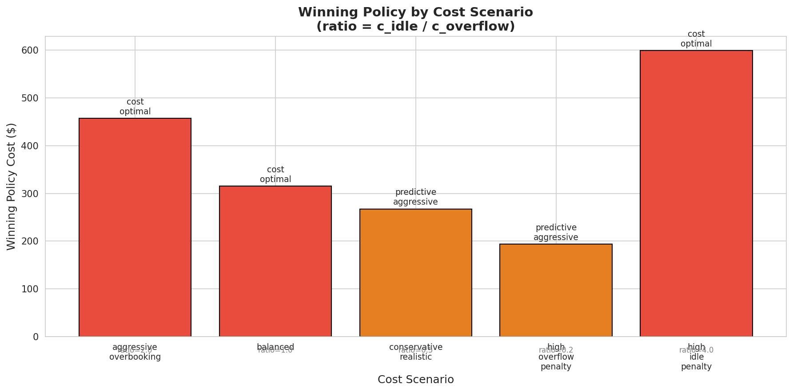
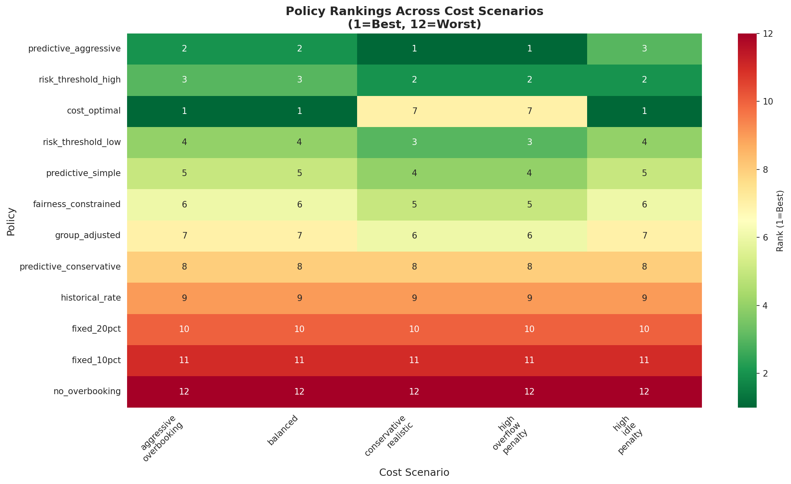

When idle time costs more than overflow, aggressive overbooking wins. When
overflow costs more than idle time, `predictive_aggressive` and the
conservative rules take over. There is no universal best policy, only a best
policy for a stated set of prices. **A clinic must price its own two failure
modes before this analysis can recommend anything to it.** Publishing the
sensitivity analysis alongside the headline is not a hedge; it is the finding.

### Robustness to a model that degrades

Models drift. Eight stress scenarios add prediction noise, shift the
underlying no-show rate, and degrade accuracy deliberately.

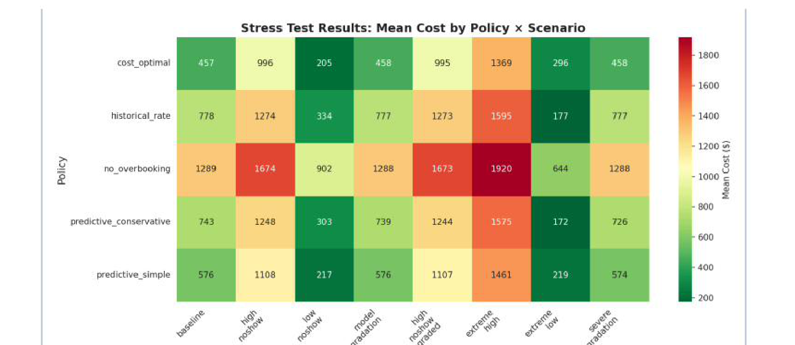
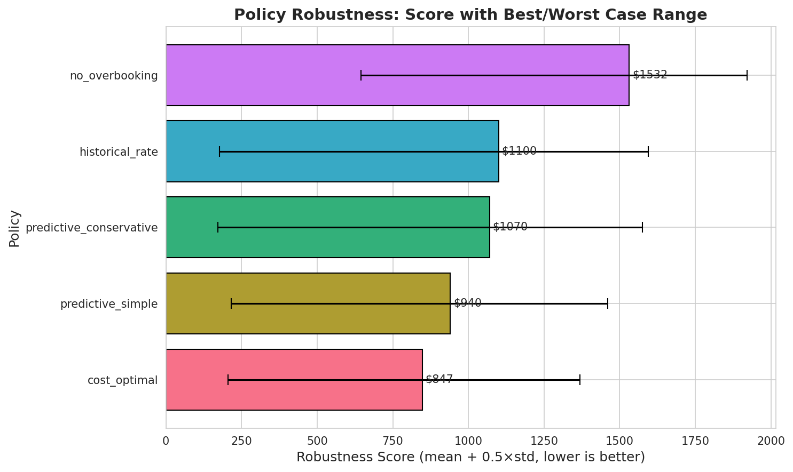

Risk-aware policies hold up. Ten percent prediction noise moves cost by under
one percent; twenty percent noise by under one percent as well. The advantage
over flat-rate booking survives degradation that would make the model's
point predictions useless, which is a direct consequence of the decision layer
integrating over the distribution rather than acting on a threshold.

### Who waits

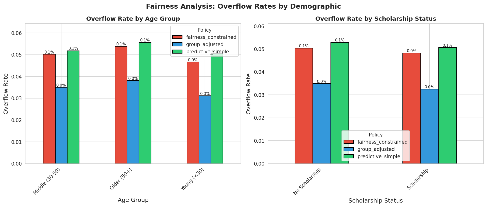

Here is the result this study was built to find, and it went the opposite way
to expectation.

| Policy | Mean cost | Overflow rate | Age disparity | Scholarship disparity |
|---|---|---|---|---|
| predictive_simple | $575.96 | 5.3% | 0.51pp (1.10×) | 0.23pp (1.05×) |
| fairness_constrained | $588.64 | 5.0% | 0.72pp (1.15×) | 0.21pp (1.04×) |
| group_adjusted | $638.49 | 3.5% | 0.69pp (1.22×) | 0.24pp (1.07×) |

**The policy explicitly designed to be fair is both more expensive and more
disparate on age than the plain predictive rule.** `fairness_constrained`
damps overbooking in sessions dense with young or scholarship patients, which
sounds right and is wrong. Because it also reduces overbooking where risk is
highest, it shifts overflow *towards* older patients in the remaining sessions
and widens the ratio it was built to close.

The lesson generalises past this dataset. A fairness intervention aimed at the
decision rule, rather than at the mechanism generating the disparity, can move
the burden somewhere unintended while looking principled on paper. It has to
be measured, not assumed. Note too that the absolute disparities are small,
well under one percentage point, while the *ratio* reaches 1.22×; which of
those two framings is the honest one depends on whether a clinic thinks in
incidents or in relative burden.

---

## Reproducing the study

```bash
git clone https://github.com/Yogarajan12/clinic-overbooking-optimization.git
cd clinic-overbooking-optimization

python -m venv .venv && source .venv/bin/activate
make install          # package plus pipeline dependencies

make all              # stages 1 to 4, in order
```

Stage 1 pulls the dataset through `kagglehub`, which needs Kaggle credentials
in `~/.kaggle/kaggle.json` or in `KAGGLE_USERNAME` and `KAGGLE_KEY`. See
[`data/README.md`](data/README.md).

Individual stages:

```bash
make features   # stage 1: clean, engineer, split chronologically
make models     # stage 2: train, calibrate, explain, audit
make optimise   # stage 3: cost model, convexity, constrained solve
make simulate   # stage 4: Monte Carlo, sensitivity, stress, fairness
```

Tests and linting:

```bash
make test       # 31 unit tests over the library
make lint       # ruff
```

Cost assumptions live in [`config/costs.yaml`](config/costs.yaml) with four
named scenarios. Changing them changes the conclusions, which is the point.

### Using the library directly

```python
import numpy as np
from noshow_overbooking import CostFunction, load_cost_config, policy_k

config = load_cost_config(scenario="default")
cost_fn = CostFunction(config)

# Calibrated no-show risk for the twenty patients holding slots
risk = np.array([0.42, 0.31, 0.55, ...])

k_star, trace = cost_fn.find_optimal_k(risk)          # Poisson-Binomial optimum
k_policy = policy_k(risk, "predictive_simple")         # simulated policy rule

print(cost_fn.expected_cost(1 - risk)["P_overflow"])   # service level at k = 0
```

---

## Layout

```
notebooks/    the archived run with outputs intact: every number in this
              README can be checked against them without re-running anything
pipeline/     the same four stages as scripts, driven by the Makefile
src/          tested library: cost model, policies, simulator, metrics
tests/        31 unit tests covering the library
config/       cost scenarios
docs/         methodology, limitations, future work, figures
data/         gitignored; stage 1 populates it
results/      gitignored; stages 1 to 4 populate it
```

`pipeline/` and `src/` overlap deliberately: the pipeline is preserved as it
ran, for provenance, and the library is the tested extraction of its decision
layer. [`CLAUDE.md`](CLAUDE.md) records the conventions and the rule that
refactoring must not move a number.

## Documentation

- [Methodology](docs/methodology.md) — modelling choices and why each was made
- [Limitations](docs/limitations.md) — four known inconsistencies, stated plainly
- [Future work](docs/future-work.md) — ordered by how much each would change the conclusions

---

## What this study actually establishes

Patient-level risk beats a flat overbooking percentage by a wide margin under
a stated cost structure, and the advantage survives substantial model
degradation. Calibration rather than discrimination is what the decision layer
requires, and a modest AUC is sufficient when the downstream use integrates
probabilities rather than thresholding them. The shadow price on the
overflow constraint gives a clinic a defensible way to convert a patient
experience preference into a budget line. And a fairness constraint applied at
the policy layer made the disparity it targeted slightly worse, which is a
result worth reporting precisely because nobody was hoping for it.

What it does not establish is that any clinic will save $598,000. That figure
is one test period, one cost structure, one simulation. Treat it as the upper
end of a range whose lower end is considerably smaller.

## Citation

```bibtex
@software{sivakumar2025_clinic_overbooking,
  author = {Sivakumar, Yogarajan},
  title  = {Clinic Overbooking with No-Show Prediction: Calibrated Risk,
            Cost-Aware Optimisation, and a Fairness Audit},
  year   = {2025},
  url    = {https://github.com/Yogarajan12/clinic-overbooking-optimization}
}
```

If you use the dataset, cite its original source on Kaggle
(`joniarroba/noshowappointments`).

## Acknowledgements

This study began as a graduate course project for CPE 608, Applied Modelling
and Optimisation, at Stevens Institute of Technology, Fall 2025.

## License

MIT, see [`LICENSE`](LICENSE). The dataset carries its own terms on Kaggle;
review them before redistributing derivatives.

---

*Research code for a methodological study. Not a medical device, not validated
for clinical use, and not suitable for making decisions about real patients.*
